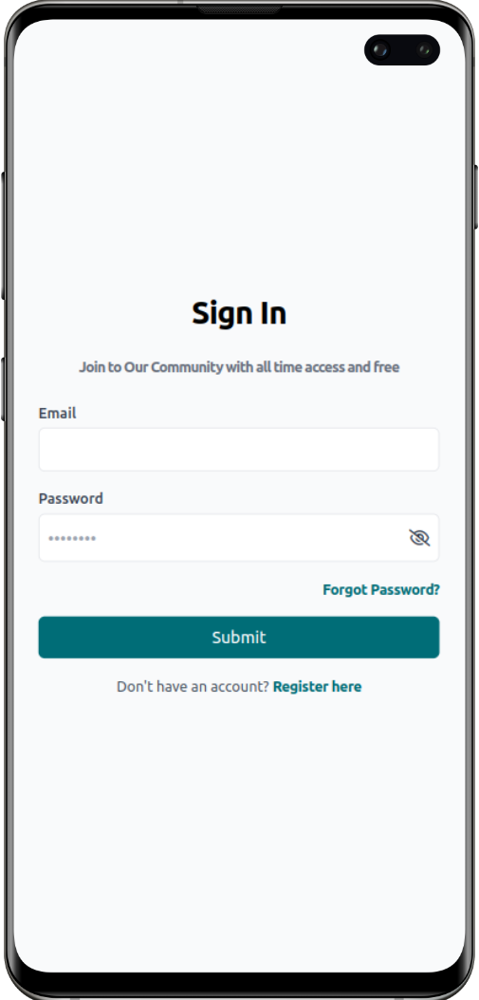

# 

 
BillBox is a Laravel-based web application designed for society accountants/auditors, tailored specifically for the needs of [Om Associates](./assets/agency.jpg?raw=true). It provides a streamlined solution for managing societies and their users, offering distinct functionalities for both administrators and regular users.

## Features

#### Theme toggle:
Toggle Button allowing users to switch between light and dark color schemes according to their preference. This feature enhances user experience by providing flexibility and customization options for the application's visual appearance. Users can seamlessly transition between light and dark modes to suit their viewing environment or personal preference, ensuring a comfortable and enjoyable browsing experience.

#### Dual User Base:
BillBox implements a dual user base system, catering to both administrators and regular users. This feature provides distinct functionalities tailored to the specific needs and roles of each user type. Administrators have access to powerful management tools, allowing them to oversee societies, users, and requests efficiently. On the other hand, regular users benefit from streamlined interfaces designed for accessing society-related information and managing their personal profiles. By supporting two distinct user roles, BillBox ensures a seamless and intuitive experience for all users, enhancing overall usability and effectiveness.

#### Maintenance Mode:
BillBox includes a custom made maintenance mode, which enables administrators to toggle he maintenance state for the application. When activated, only administrators have access to the site, while regular users are redirected to a custom page.

   

In summary, BillBox offers a comprehensive suite of features designed to empower administrators with robust management tools and provide regular users with intuitive interfaces for efficient society management. With convenient theme toggles for personalized visual experiences and seamless maintenance mode controls for uninterrupted site management, BillBox ensures a smooth and enjoyable experience for all users, reinforcing its commitment to delivering excellence in society accounting and auditing services.

## Page Preview

  
Auth Pages

  
  

    &nbsp;
    &nbsp;
    &nbsp;
  

  
User Pages

  
  

      
    &nbsp;
    &nbsp;
  

  
Admin Pages

  
  

     
    
<b>Dashboard</b>

    &nbsp;
    &nbsp;  
    
<b>Upload</b>

    &nbsp;
  

  
Maintenance Page

  
  

    
  

## Credits - Design and Branding

This project is built on a professionally designed [Soft Ui Dashboard template](https://www.creative-tim.com/product/soft-ui-dashboard-tailwind) as its foundation, providing a visually appealing and user-friendly interface. For icons library I have used [FontAwesome Icons](https://fontawesome.com/icons) and the logo for this project was created using [LOGO.com](https://logo.com/), a platform that offers customizable logo designs tailored to specific brand identities. In addition, some code components within BillBox are sourced from [Tailwind Components](https://tailwindcomponents.com/), a repository of reusable UI components built with Tailwind CSS.
